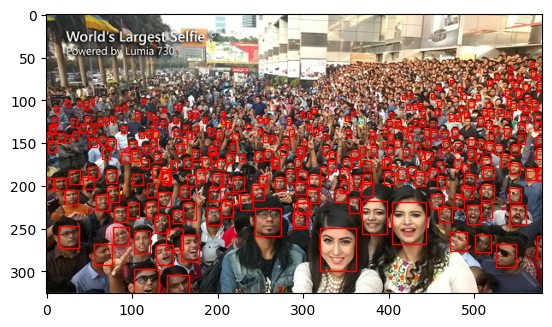

# yolov8face
Yolov8face is a Python wrapper of Ultrlytics that simplifies the process of detecting faces in images using the yolov8n-face model. It takes care of pre-trained model downloading, loading and postprocessing, allowing you to detect faces in images with just a few lines of code. 

## Installation
```bash
pip install yolov8face
```
## Usage
```python
from yolov8face import get_bbox
bboxes = get_bbox('path-to-image/image.jpg')
```
## Example



